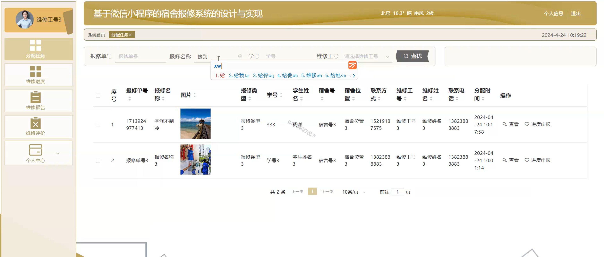

# mpweixinA071
mpweixinA071宿舍报修微信小程序LW
 
## 查看主页获取源码

### 一、作品包含

源码+数据库+万字文档+全套环境和工具资源+部署教程

### 二、项目技术

前端技术：Html、Css、Js、Vue2.0、Element-ui、Uniapp

数据库：MySQL

后端技术：Java、Spring Boot、MyBatis

  

### 三、运行环境

开发工具：IDEA/eclipse + HBuilderX + 微信开发者工具

数据库：MySQL5.7（最低要5.7版本）

数据库管理工具：Navicat10以上版本

环境配置软件： JDK1.8+Maven3.6.3

前端Nodejs：14

### 四、项目介绍
项目编号：mpweixinA071

基于微信小程序的宿舍报修系统是一种便捷的在线服务平台，用于学生快速提交宿舍维修需求，管理员高效处理和跟踪维修进度，提升宿舍管理效率与居住体验。

主要分为管理员和学生角色，主要功能有通知公告，故障申报，，学生管理，维修员，宿舍信息，报修类型，分配任务，维修进度，维修报告，维修评价，系统管理等等功能。

### 五、运行截图

  
